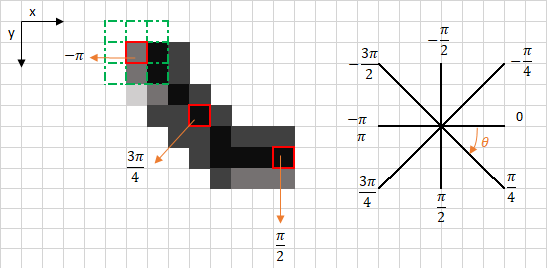

# CANNY EDGE DETECTION
Original                   |  Final
:-------------------------:|:-------------------------:
   |  
 
 

## INTRODUCTION

Canny edge detection is a image processing method used to detect edges in an image while suppressing noise. The main steps are as follows:

* Step 1 - Grayscale Conversion

* Step 2 - Gaussian Blur

* Step 3 - Determine the Intensity Gradients

* Step 4 - Non Maximum Suppression

* Step 5 - Double Thresholding

* Step 6 - Edge Tracking by Hysteresis

* Step 7 - Cleaning Up

## ALGORITHM STEPS

### STEP 1 - GRAYSCALE CONVERSION

Convert the image to grayscale.

Original                   |  Black and White
:-------------------------:|:-------------------------:
   |  

There are two methods to convert color image into a grayscale image. Both has their own merits and demerits. The methods are:

* Average method

* Weighted method or luminosity method

#### Average method

Average method is the most simple one. You just have to take the average of three colors. Since its an RGB image, so it means that you have add r with g with b and then divide it by 3 to get your desired grayscale image:

Grayscale = (R + G + B / 3)

For example:

Original                   |  Grayscale (avg)
:-------------------------:|:-------------------------:
   |  

##### Explanation
There is one thing to be sure, that something happens to the original works. It means that our average method works. But the results were not as expected. We wanted to convert the image into a grayscale, but this turned out to be a rather black image.

##### Problem
This problem arise due to the fact, that we take average of the three colors. Since the three different colors have three different wavelength and have their own contribution in the formation of image, so we have to take average according to their contribution, not done it averagely using average method. Right now what we are doing is this,

33% of Red,	33% of Green, 33% of Blue

We are taking 33% of each, that means, each of the portion has same contribution in the image. But in reality thats not the case. The solution to this has been given by luminosity method.

#### Weighted method or luminosity method

You have seen the problem that occur in the average method. Weighted method has a solution to that problem. Since red color has more wavelength of all the three colors, and green is the color that has not only less wavelength then red color but also green is the color that gives more soothing effect to the eyes.

It means that we have to decrease the contribution of red color, and increase the contribution of the green color, and put blue color contribution in between these two.

So the new equation that form is:

New grayscale image = ( (0.3 * R) + (0.59 * G) + (0.11 * B) ).

According to this equation, Red has contribute 30%, Green has contributed 59% which is greater in all three colors and Blue has contributed 11%.

Applying this equation to the image, we get this

Original                   |  Grayscale (luminosity)
:-------------------------:|:-------------------------:
   |  

##### Explanation
As you can see here, that the image has now been properly converted to grayscale using weighted method. As compare to the result of average method, this image is more brighter.

### STEP 2 - GAUSSIAN BLUR

Perform a Gaussian blur on the image. The blur removes some of the noise before further processing the image. A sigma of 1.4 is used in this example and was determined through trial and error.

Gaussian Blur                   
:-------------------------:

Mathematically, applying a Gaussian blur to an image is the same as ***convolving*** the image with a Gaussian function. This is also known as a ***two-dimensional Weierstrass transform***. 

Specifically, a Gaussian kernel (used for Gaussian blur) is a square array of pixels where the pixel values correspond to the values of a Gaussian curve (in 2D).

Gaussian kernel                   
:-------------------------:

Each pixel in the image gets multiplied by the Gaussian kernel. This is done by placing the center pixel of the kernel on the image pixel and multiplying the values in the original image with the pixels in the kernel that overlap. The values resulting from these multiplications are added up and that result is used for the value at the destination pixel. Looking at the image, you would multiply the value at (0,0) in the input array by the value at (i) in the kernel array, the value at (1,0) in the input array by the value at (h) in the kernel array, and so on. and then add all these values to get the value for (1,1) at the output image.

Convolution                   
:-------------------------:

Convolution can be done by multiplying each input pixel with the entire kernel. However, if the kernel is symmetrical (which a Gaussian kernel is) you can also multiply each axis (x and y) independently, which will decrease the total number of multiplications. In proper mathematical terms, if a matrix is separable it can be decomposed into (M×1) and (1×N) matrices. For the Gaussian kernel above this means you can also use the following kernels:

Kernel Decomposition                   
:-------------------------:

You would now multiply each pixel in the input image with both kernels and add the resulting values to get the value for the output pixel.

##### Additional resourse:

If the 2D filter kernel has a rank of 1 then it is separable.

But how can we determine the outer product vectors? The answer is to go back to the svd function. Here's a snippet: 
[U,S,V] = svd(X) produces a diagonal matrix S of the same dimension as X, with nonnegative diagonal elements in decreasing order, and unitary matrices U and V so that X = U*S*V'.
A rank 1 matrix has only one nonzero singular value, so U*S*V' becomes U(:,1) * S(1,1) * V(:,1)'. This is basically the outer product we were seeking. Therefore, we want the first columns of U and V. (We have to remember also to use the nonzero singular value as a scale factor.)

### STEP 3 - DETERMINE THE INTENSITY GRADIENTS

Mathematically, the gradient of a two-variable function (here the image intensity function) at each image point is a 2D vector with the components given by the derivatives in the horizontal and vertical directions. At each image point, the gradient vector points in the direction of largest possible intensity increase, and the length of the gradient vector corresponds to the rate of change in that direction.

Since the intensity function of a digital image is only known at discrete points, derivatives of this function cannot be defined unless we assume that there is an underlying continuous intensity function which has been sampled at the image points. With some additional assumptions, the derivative of the continuous intensity function can be computed as a function on the sampled intensity function, i.e., the digital image. Approximations of these derivative functions can be defined at varying degrees of accuracy. The most common way to approximate the image gradient is to ***convolve an image with a kernel, such as the Sobel operator or Prewitt operator***.

So each pixel of a gradient image measures the change in intensity of that same point in the original image, in a given direction. To get the full range of direction, gradient images in the x and y directions are computed. After gradient images have been computed, pixels with large gradient values become possible edge pixels. The pixels with the largest gradient values in the direction of the gradient become edge pixels, and edges may be traced in the direction perpendicular to the gradient direction.

The magnitude of the image results in the following output:

Gradient Magnitude                   
:-------------------------:

#### Now about ***Sobel operator (or filter) or Sobel–Feldman operator***

Technically, it is a ***discrete differentiation operator***, computing an approximation of the gradient of the image intensity function. At each point in the image, the result of the Sobel–Feldman operator is either the corresponding gradient vector or the norm of this vector. The Sobel–Feldman operator is based on convolving the image with a small, separable, and integer-valued filter in the horizontal and vertical directions and is therefore relatively inexpensive in terms of computations. On the other hand, the gradient approximation that it produces is relatively crude, in particular for high-frequency variations in the image.

The operator uses two 3×3 kernels which are convolved with the original image to calculate approximations of the derivatives – one for horizontal changes, and one for vertical. If we define A as the source image, and Gx and Gy are two images which at each point contain the vertical and horizontal derivative approximations respectively, the computations are as follows:

Since the Sobel kernels can be decomposed as the products of an averaging and a differentiation kernel, they compute the gradient with smoothing. For example, G_x can be written as

The x-coordinate is defined here as increasing in the "right"-direction, and the y-coordinate is defined as increasing in the "down"-direction. At each point in the image, the resulting gradient approximations can be combined to give the gradient magnitude, using:

Using this information, we can also calculate the gradient's direction:

where, for example, Θ is 0 for a vertical edge which is lighter on the right side.

### STEP 4 - NON MAXIMUM SUPPRESSION

Ideally, the final image should have thin edges. Thus, we must perform non-maximum suppression to thin out the edges.
The principle is simple: the algorithm goes through all the points on the gradient intensity matrix and finds the pixels with the maximum value in the edge directions.
Let’s take an easy example:

The upper left corner red box present on the above image, represents an intensity pixel of the Gradient Intensity matrix being processed. The corresponding edge direction is represented by the orange arrow with an angle of -pi radians (+/-180 degrees).

The edge direction is the orange dotted line (horizontal from left to right). The purpose of the algorithm is to check if the pixels on the same direction are more or less intense than the ones being processed. In the example above, the pixel (i, j) is being processed, and the pixels on the same direction are highlighted in blue (i, j-1) and (i, j+1). If one those two pixels are more intense than the one being processed, then only the more intense one is kept. Pixel (i, j-1) seems to be more intense, because it is white (value of 255). Hence, the intensity value of the current pixel (i, j) is set to 0. If there are no pixels in the edge direction having more intense values, then the value of the current pixel is kept.

Let’s now focus on another example:

In this case the direction is the orange dotted diagonal line. Therefore, the most intense pixel in this direction is the pixel (i-1, j+1).

***Let’s sum this up***. Each pixel has 2 main criteria (edge direction in radians, and pixel intensity (between 0–255)). Based on these inputs the non-max-suppression steps are:

* Create a matrix initialized to 0 of the same size of the original gradient intensity matrix;

* Identify the edge direction based on the angle value from the angle matrix;

* Check if the pixel in the same direction has a higher intensity than the pixel that is currently processed;

* Return the image processed with the non-max suppression algorithm.

The result of this is:

### STEP 5 - DOUBLE THRESHOLDING

The double threshold step aims at identifying 3 kinds of pixels: ***strong***, ***weak***, and ***non-relevant***:

* Strong pixels are pixels that have an intensity so high that we are sure they contribute to the final edge.

* Weak pixels are pixels that have an intensity value that is not enough to be considered as strong ones, but yet not small enough to be considered as non-relevant for the edge detection.

* Other pixels are considered as non-relevant for the edge.

Now you can see what the double thresholds holds for:

* High threshold is used to identify the strong pixels (intensity higher than the high threshold)

* Low threshold is used to identify the non-relevant pixels (intensity lower than the low threshold)

* All pixels having intensity between both thresholds are flagged as weak and the Hysteresis mechanism (next step) will help us identify the ones that could be considered as strong and the ones that are considered as non-relevant.

The result of this step is an image with only 2 pixel intensity values (strong and weak):

Double Thresholding                
:-------------------------:

### STEP 6 - EDGE TRACKING BY HYSTERESIS

Based on the threshold results, the hysteresis consists of transforming weak pixels into strong ones, if and only if at least one of the pixels around the one being processed is a strong one, as described below:

The Result is:

Edge Tracking             
:-------------------------:

### STEP 7 - CLEANING UP

Finally, we will iterate through the remaining weak edges and set them to zero resulting in the final processed image:

Final Result from Canny Edge Detection Algorithm      
:-------------------------:

