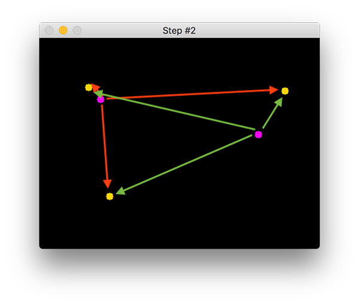

# CENTROID BASED OBJECT TRACKING

## INTRODUCTION

***Object tracking is the process of:***

* Taking an initial set of object detections (such as an input set of bounding box coordinates).

* Creating a unique ID for each of the initial detections.

* And then tracking each of the objects as they move around frames in a video, maintaining the assignment of unique IDs

Furthermore, object tracking allows us to apply a unique ID to each tracked object, making it possible for us to count unique objects in a video. Object tracking is paramount to building a person counter.

***An ideal object tracking algorithm will:***

* Only require the object detection phase once (i.e., when the object is initially detected)

* Will be extremely fast — much faster than running the actual object detector itself

* Be able to handle when the tracked object “disappears” or moves outside the boundaries of the video frame

* Be robust to occlusion

* Be able to pick up objects it has “lost” in between frames

This is a tall order for any computer vision or image processing algorithm and there are a variety of tricks we can play to help improve our object trackers.

## THE FUNDAMENTALS OF CENTROID-BASED OBJECT TRACKING

***Centroid-based*** tracking is an easy to understand, yet highly effective tracking algorithm. There are also more advanced ***kernel-based*** and ***correlation-based*** tracking algorithms which are not considered in this project.

This object tracking algorithm is called centroid tracking as it relies on the Euclidean distance between (1) existing object centroids (i.e., objects the centroid tracker has already seen before) and (2) new object centroids between subsequent frames in a video.

***The centroid tracking algorithm is a multi-step process.***

### Step #1: Accept bounding box coordinates and compute centroids.

Figure 1
:-------------------------:

The centroid tracking algorithm assumes that we are passing in a set of bounding box (x, y)-coordinates for each detected object in every single frame.

These bounding boxes can be produced by any type of object detector you would like (color thresholding + contour extraction, Haar cascades, HOG + Linear SVM, SSDs, Faster R-CNNs, etc.), provided that they are computed for every frame in the video.

These bounding boxes can be produced by any type of object detector you would like (color thresholding + contour extraction, Haar cascades, HOG + Linear SVM, SSDs, Faster R-CNNs, etc.), provided that they are computed for every frame in the video.

Once we have the bounding box coordinates we must compute the “centroid”, or more simply, the center (x, y)-coordinates of the bounding box. Figure 1 above demonstrates accepting a set of bounding box coordinates and computing the centroid.

Since these are the first initial set of bounding boxes presented to our algorithm we will assign them unique IDs.

### Step #2: Compute Euclidean distance between new bounding boxes and existing objects

Figure 2
:-------------------------:

For every subsequent frame in our video stream we apply Step #1 of computing object centroids; however, instead of assigning a new unique ID to each detected object (which would defeat the purpose of object tracking), we first need to determine if we can associate the new object centroids (yellow) with the old object centroids (purple). To accomplish this process, we compute the Euclidean distance (highlighted with green arrows) between each pair of existing object centroids and input object centroids.

From Figure 2 you can see that we have this time detected three objects in our image. The two pairs that are close together are two existing objects.

We then compute the Euclidean distances between each pair of original centroids (yellow) and new centroids (purple). But how do we use the Euclidean distances between these points to actually match them and associate them?

The answer is in Step #3.

### Step #3: Update (x, y)-coordinates of existing objects

Figure 3
:-------------------------:

The primary assumption of the centroid tracking algorithm is that a given object will potentially move in between subsequent frames, but the distance between the centroids for frames F_t and F_{t + 1} will be smaller than all other distances between objects.

Therefore, if we choose to associate centroids with minimum distances between subsequent frames we can build our object tracker.

In Figure 3 you can see how our centroid tracker algorithm chooses to associate centroids that minimize their respective Euclidean distances.

But what about the lonely point in the bottom-left?

It didn’t get associated with anything — what do we do with it?

### Step #4: Register new objects

Figure 4
:-------------------------:

In the event that there are more input detections than existing objects being tracked, we need to register the new object. “Registering” simply means that we are adding the new object to our list of tracked objects by:

* Assigning it a new object ID

* Storing the centroid of the bounding box coordinates for that object

We can then go back to Step #2 and repeat the pipeline of steps for every frame in our video stream.

Figure 4 demonstrates the process of using the minimum Euclidean distances to associate existing object IDs and then registering a new object.

### Step #5: Deregister old objects

Any reasonable object tracking algorithm needs to be able to handle when an object has been lost, disappeared, or left the field of view.

Exactly how you handle these situations is really dependent on where your object tracker is meant to be deployed, but for this implementation, we will deregister old objects when they cannot be matched to any existing objects for a total of N subsequent frames.

## LIMITATIONS AND DRAWBACKS

There are two primary drawbacks of this object tracking algorithm.

* The first is that it requires that object detection step to be run on every frame of the input video.

* The second drawback is related to the underlying assumptions of the centroid tracking algorithm itself — centroids must lie close together between subsequent frames.

    * This assumption typically holds, but keep in mind we are representing our 3D world with 2D frames — what happens when an object overlaps with another one?

    * The answer is that object ID switching could occur.

    * If two or more objects overlap each other to the point where their centroids intersect and instead have the minimum distance to the other respective object, the algorithm may (unknowingly) swap the object ID.

    * It’s important to understand that the overlapping/occluded object problem is not specific to centroid tracking — it happens for many other object trackers as well, including advanced ones.

    * However, the problem is more pronounced with centroid tracking as we relying strictly on the Euclidean distances between centroids and no additional metrics, heuristics, or learned patterns.

