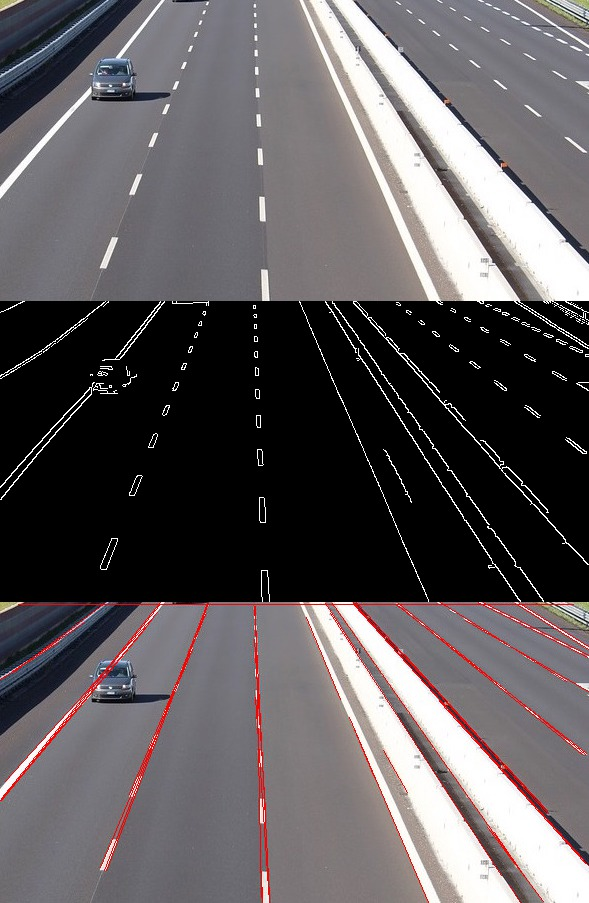
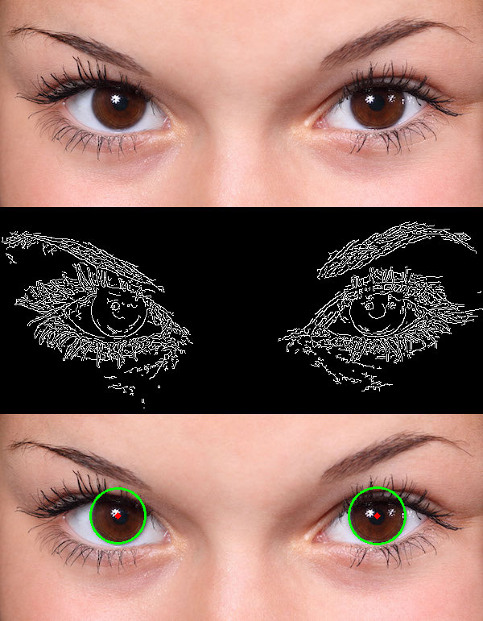
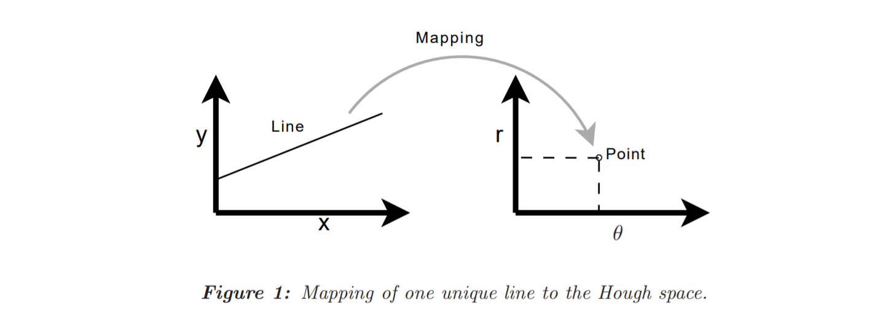
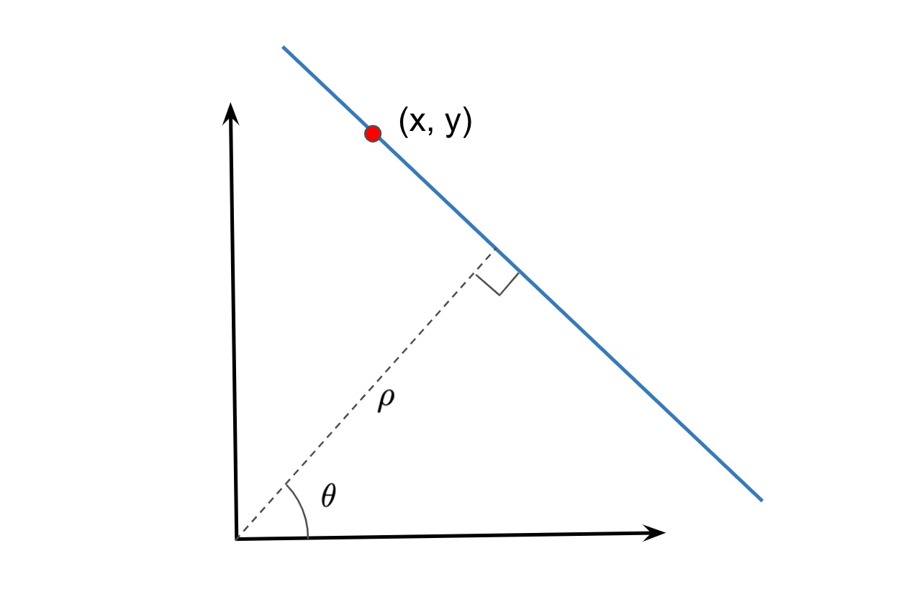
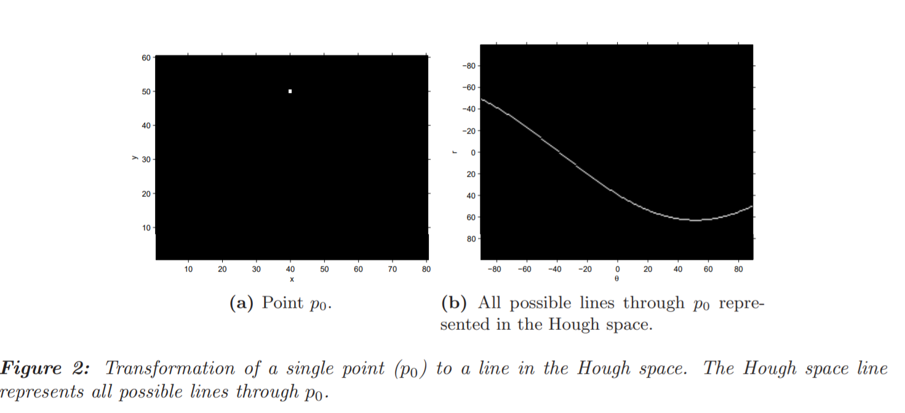
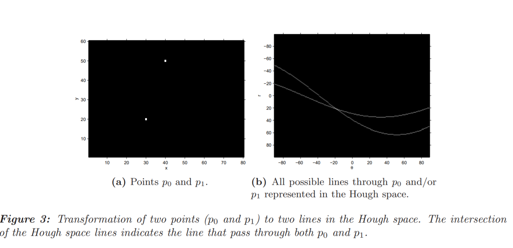
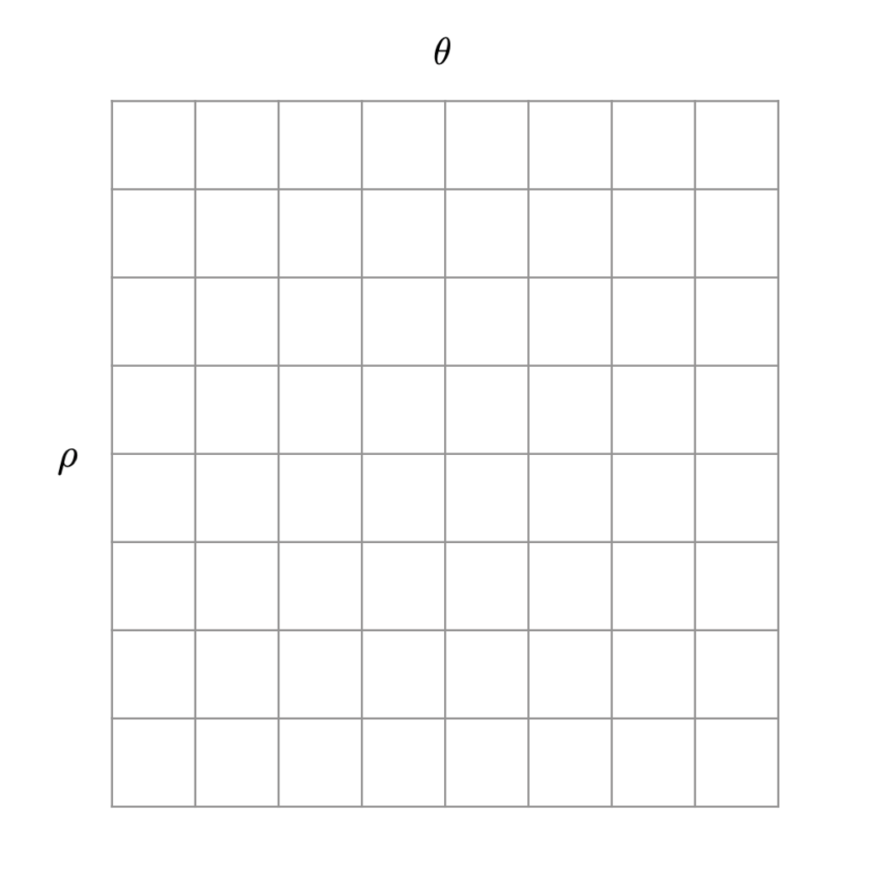
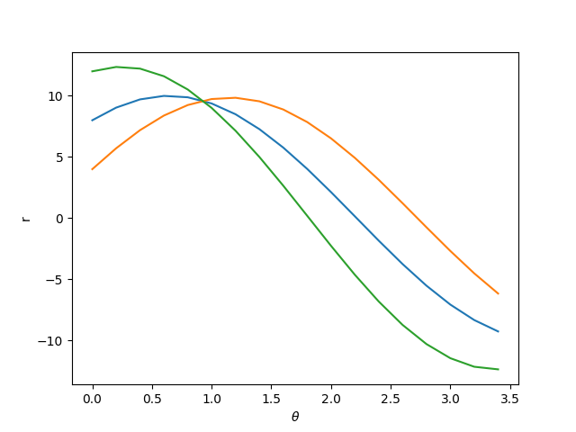
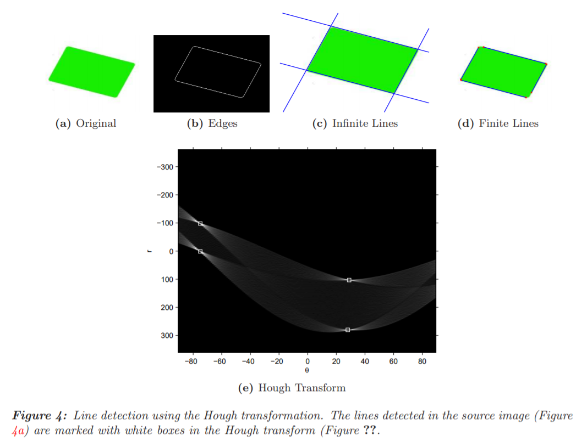

# HOUGH TRANSFORM

## INTRODUCTION

The Hough transform is a feature extraction technique used in image analysis, computer vision, and digital image processing. The purpose of the technique is to find imperfect instances of objects within a certain class of shapes by a ***voting procedure***. This voting procedure is carried out in a parameter space, from which object candidates are obtained as local maxima in a so-called accumulator space that is explicitly constructed by the algorithm for computing the Hough transform.

The classical Hough transform was concerned with the identification of lines in the image, but later the Hough transform has been extended to identifying positions of ***arbitrary shapes***, most ***commonly circles or ellipses***. The Hough transform as it is universally used today was invented by ***Richard Duda and Peter Hart in 1972***, who called it a ***"generalized Hough transform"*** after the related 1962 patent of Paul Hough.

Line Detection             |  Circle Detection
:-------------------------:|:-------------------------:
   |  
 

## LINE DETECTION

### Representation of Lines in the Hough Space

Lines can be represented uniquely by two parameters. Often the form in Equation 1 is used with parameters a and b:

This form is, however, not able to represent vertical lines. Therefore, the Hough transform uses the form in Equation 2, which can be rewritten to Equation 3 to be similar to Equation 1. The parameters θ and r (here r and ρ are interchangable and I will use them so ) is the angle of the line and the distance from the line to the origin respectively.

All lines can be represented in this form when θ ∈ [0, 180] and r ∈ R (or θ ∈ [0, 360] and r ≥ 0). The Hough space for lines has therefore these two dimensions; θ and r, and a line is represented by a single point, corresponding to a unique set of parameters (θ0, r0). The line to-point mapping is illustrated in Figure 1.

So the the polar form of a line is represented as:

### Mapping of Points to Hough Space

An important concept for the Hough transform is the mapping of single points. The idea is, that a point is mapped to all lines, that can pass through that point. This yields a sine-like line in the Hough space. The principle is illustrated for a point p0 = (40, 50) in Figure 2.

## ALGORITHM

The algorithm for detecting straight lines can be divided into the following steps:

* Edge detection, e.g. using the Canny edge detector.

* Mapping of edge points to the Hough space and store in an accumulator.

* Interpretation of the accumulator to yield lines of infinite length. The interpretation is done by thresholding and possibly other constraints.

* Conversion of infinite lines to finite lines.

The finite lines can then be superimposed back on the original image. The Hough transform itself is performed in point 2, but all steps except edge detection is covered in this project.

### TRANSFORMATION TO HOUGH SPACE

The Hough transform takes a binary edge map as input and attempts to locate edges placed as straight lines. The idea of the Hough transform is, that ***every edge point in the edge map is transformed to all possible lines that could pass through that point***. Figure 2 illustrates this for a single point, and Figure 3 illustrates this for two points.

A typical edge map includes many points, but the principle for line detection is the same as illustrated in Figure 3 for two points. Each edge point is transformed to a line in the Hough space, and the areas where most Hough space lines intersect is interpreted as true lines in the edge map.

####  THE HOUGH SPACE ACCUMULATOR

When we say that a line in 2D space is parameterized by ρ and θ, it means that if we any pick a (ρ, θ), it corresponds to a line.

Imagine a 2D array where the x-axis has all possible θ values and the y-axis has all possible ρ values. Any bin in this 2D array corresponds to one line.

This 2D array is called an ***accumulator*** because we will use the bins of this array to collect evidence about which lines exist in the image. The top left cell corresponds to a (-R, 0) and the bottom right corresponds to (R, pi).

We will see in a moment that the value inside the bin (ρ, θ) will increase as more evidence is gathered about the presence of a line with parameters ρ and θ.

To determine the areas where most Hough space lines intersect, an ***accumulator covering the Hough space is used***. When an edge point is transformed, bins in the accumulator is incremented for all lines that could pass through that point. The resolution of the accumulator determines the precision with which lines can be detected.

The following steps are performed to detect lines in an image.

***Initialize Accumulator:*** The number of cells you choose to have is a design decision. Let’s say you chose a 10×10 accumulator. It means that \rho can take only 10 distinct values and the \theta can take 10 distinct values, and therefore you will be able to detect 100 different kinds of lines. The size of the accumulator will also depend on the resolution of the image. But if you are just starting, don’t worry about getting it perfectly right. Pick a number like 20×20 and see what results you get.

## DETECTION OF INFINITE LINES

For every edge pixel (x, y) in the above array, we vary the values of θ from 0 to pi and plug it in equation 2 to obtain a value for ρ.

In the Figure below we vary the θ for three pixels ( represented by the three colored curves ), and obtain the values for ρ using equation 2.

As you can see, these curves intersect at a point indicating that a line with parameters θ = 1 and ρ =  9.5 is passing through them.

Typically, we have hundreds of edge pixels and the accumulator is used to find the intersection of all the curves generated by the edge pixels.

Let’s see how this is done.

Let’s say our accumulator is 20×20 in size. So, there are 20 distinct values of θ and so for every edge pixel (x, y), we can calculate 20 (ρ, θ) pairs by using equation 2. The bin of the accumulator corresponding to these 20 values of (ρ, θ) is incremented.

We do this for every edge pixel and now we have an accumulator that has all the evidence about all possible lines in the image.

We can simply select the bins in the accumulator above a certain threshold to find the lines in the image. If the threshold is higher, you will find fewer strong lines, and if it is lower, you will find a large number of lines including some weak ones.

An example of the entire line detection process is shown in Figure 4.

As it is obvious from Figure 4e, several entrances in the accumulator around one true line in the edge map will have large values. Therefore a simple threshold has a tendency to detect several (almost identical) lines for each true line. To avoid this, a suppression neighborhood can be defined, so that two lines must be significantly different before both are detected.

## FINITE LINES

The classical Hough transform detects lines given only by the parameters r and θ and no information with regards to length. Thus, all detected lines are infinite in length. If finite lines are desired, some additional analysis must be performed to determine which areas of the image that contributes to each line. Several algorithms for doing this exist. One way is to store coordinate information for all points in the accumulator, and use this information to limit the lines. However, this would cause the accumulator to use much more memory. Another way is to search along the infinit lines in the edge image to find finit lines. A variant of this approach known as the ***Progressive Probabilistic Hough Transform***

# PROGRESSIVE PROBABILISTIC HOUGH TRANSFORM

The Hough transform is not a fast algorithm for finding infinite lines in images of a certain size. Since additional analysis is required to detect finite lines, this is even slower. A way to speed up the Hough Transform and finding finite lines at the same time is the Progressive Probabilistic Hough Transform (PPHT). The idea of this methood is to transform randomly selected pixels in the edge image into the accumulator. When a bin in the accumulator corresponding to a particular infinite line has got a certain number of votes, the edge image is searched along that line to see if one or more finite line(s) are present. Then all pixels on that line are removed from the edge image. In this way the algorithm returns finite lines. If the vote threshold is low the number of pixels to evaluate in the accumulator gets small. The algorithm can be outlined as follows:

* 1. Create a copy (IMG2) of the input edge image (IMG1).

* 2. If IMG2 is empty then finish.

* 3. Update the accumulator with a randomly selected pixel from IMG2.

* 4. Remove the pixel from IMG2.

* 5. If the bin with the largest value in the accumulator (BINX) that was modified is lower than the threshold, goto point 1.

* 6. Search in IMG1 along a corridor specified by BINX, and find the longest segment of pixels either continuous or exhibiting gaps not exceeding a given threshold.

* 7. Remove the pixels in the segment from IMG2.

* 8. Clear BINX.

* 9. If the detected line segment is longer than a given minimum length, add it into the output list.

* 10. Goto point 2

An issue with this algorithm is, that severel runs may may yield different results. This can be the case if many lines share pixels. If two lines cross, the fist line to be detected removes the common pixel (and a band around it) resulting in a gab in the other line. If many lines cross, then many pixels can miss in the last lines, and the votes in the accumulator may not reach the threshold.

# CIRCLE DETECTION

Hough transform can be extended to detect circles of the equation r^2=(x−a)^2+(y−b)^2 in the parameter space, ρ=(a,b,r). Furthermore, it can be generalized to detect arbitrary shapes.

The quality of result depends heavily on the quality of edges you can find, and also on how much prior knowledge you have about the size of the circle you want to detect.
