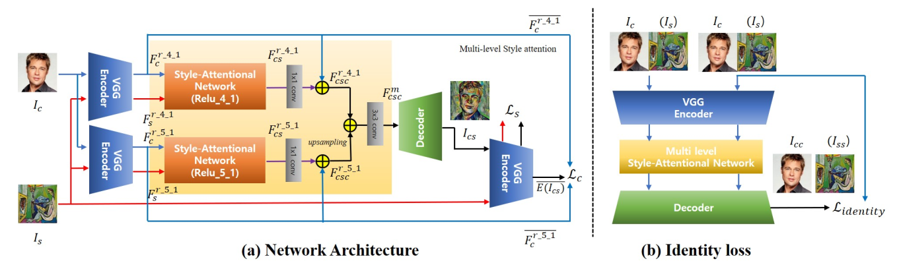

# SANet
This repository contains the code (in [TensorFlow](https://www.tensorflow.org/)) for the paper:

[**Arbitrary Style Transfer with Style-Attentional Networks**](https://arxiv.org/abs/1812.02342)
 
Dae Young Park,
Kwang Hee Lee
 

Arbitrary style transfer aims to synthesize a content image with the style of an image to create a third image that has never been seen before. Recent arbitrary style transfer algorithms find it challenging to balance the content structure and the style patterns. Moreover, simultaneously maintaining the global and local style patterns is difficult due to the patch-based mechanism. In this paper, authors introduce a novel style-attentional network (SANet) that efficiently and flexibly integrates the local style patterns according to the semantic spatial distribution of the content image. A new identity loss function and multi-level feature embeddings enable SANet and decoder to preserve the content structure as much as possible while enriching the style patterns. Experimental results demonstrate that algorithm synthesizes stylized images in real-time that are higher in quality than those produced by the state-of-the-art algorithms. The SANet is trained using MS-COCO 2014 dataset (about 12.6GB) and WikiArt dataset (about 36GB).

System overview. Picture comes from original paper.

  

 

Some Results:

Content–style trade-off during runtime:

Style interpolaton:

Color preserving:

## Prerequisites
- [Microsoft COCO dataset](http://msvocds.blob.core.windows.net/coco2014/train2014.zip)
- [WikiArt dataset](https://www.kaggle.com/c/painter-by-numbers)

## Installation
    $ git clone https://github.com/lev1khachatryan/ASDS_CV.git
    $ cd ASDS_CV/FinalProject_SANet
    $ python setup.py install

## My Running Environment
<b>Hardware</b>
- CPU: Intel® Core™ i7-8700X (3.70GHz x 12 cores, 24 threads)
- GPU: NVIDIA® GeForce GTX 1080/PCle/SSE2
- Memory: 62GB GiB
- OS type: 64-bit
- Disk: 1.2 TB

<b>Operating System</b>
- ubuntu 16.04 LTS

<b>Software/Libraries</b>
- Python 3.6.2
- NumPy 1.13.1
- TensorFlow 1.4.0
- PIL 6.0.0
- SciPy 1.1.0
- CUDA 8.0.61
- cuDNN 6.0.21

