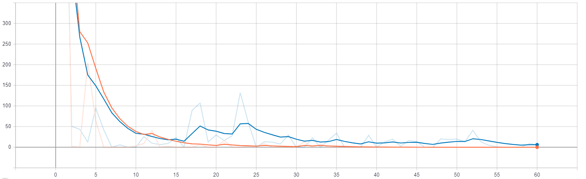

# City Classification

***Project consists of 2 parts:***

* [data preparation](https://github.com/lev1khachatryan/CityClassification/tree/master/data_preparation)

* [modeling](https://github.com/lev1khachatryan/CityClassification/tree/master/src)

## 1. data preparation

This part consists of 4 sections.

### 1.1 train data preprocessing

This is the [data_preparation/1_train_preprocessor.py](https://github.com/lev1khachatryan/CityClassification/blob/master/data_preparation/1_train_preprocessor.py) script which includes bad image discarding, save their names to [data/corrupted_images.txt](https://github.com/lev1khachatryan/CityClassification/blob/master/data/corrupted_images.txt) (as you can see there are 2 bad images).

*Note*: If we just change the extension of image, let's say from "jpg" to "Be" or to "$" (which are random characters), we do not corrupt it, so we can read it with PIL or scipy.misc.imread etc. and use them in our training process. That is why I do not delete them from data set.

train preprocessing also includes moving of all training images to "yerevan" and "london" directories.

### 1.2 test data preprocessing

This is the [data_preparation/2_test_preprocessor.py](https://github.com/lev1khachatryan/CityClassification/blob/master/data_preparation/2_test_preprocessor.py) script, which discards bad images from test dataset. As you can see, here we have 1 corrupted image as well as in train dataset [data/corrupted_images.txt](https://github.com/lev1khachatryan/CityClassification/blob/master/data/corrupted_images.txt).

### 1.3 Validation set extraction from train set

In [data_preparation/config.INI](https://github.com/lev1khachatryan/CityClassification/blob/master/data_preparation/config.INI) file you can specify validation set size, and [data_preparation/3_validation_split.py](https://github.com/lev1khachatryan/CityClassification/blob/master/data_preparation/3_validation_split.py) script will randomly choose images from train set and move them to validation folder. In order to avoid "inbalanced data" problem, script chooses images uniformly from both classes.

### 1.4 Data augmentation

This is the [data_preparation/4_data_augmentation.py](https://github.com/lev1khachatryan/CityClassification/blob/master/data_preparation/4_data_augmentation.py) script, which get all necessary parameters from [data_preparation/config.INI](https://github.com/lev1khachatryan/CityClassification/blob/master/data_preparation/config.INI) file, load images from directories (train and validation) and applies one of three transformations (rotation, noise adding and horizontal flipping). In config file you can specify ratio of augmented data.

## 2. modeling

This part also consists of 4 sections.

### 2.1 Base NN

This is the main section of modeling. [src/models/BaseNN.py](https://github.com/lev1khachatryan/CityClassification/blob/master/src/models/BaseNN.py) is an abstract class responsible for ***network creation***, ***initialization***, ***training***, ***testing*** and ***saving*** to specified directory. It also contains ***network*** abstract method implemented in derived (child) class, which gives us high level of abstraction and ability to create different types of networks with a little code change.

### 2.2 Specific Architectures

These are derived classes from BaseNN. I use 2 architectures: [src/models/CNN.py](https://github.com/lev1khachatryan/CityClassification/blob/master/src/models/CNN.py) and [src/models/DNN.py](https://github.com/lev1khachatryan/CityClassification/blob/master/src/models/DNN.py). These classes are responsible for implementing abstract methods of BaseNN class, so they ***construct the network***, ***defines the metric***, ***attach summaries*** and ***load tensors***.

### 2.3 Data loader

This [src/data_loader.py](https://github.com/lev1khachatryan/CityClassification/blob/master/src/data_loader.py) class gives all required methods for train/test/validation data loading and additional information for network constructing.

### 2.4 Starting points

[src/mainCNN.py](https://github.com/lev1khachatryan/CityClassification/blob/master/src/mainCNN.py) and [src/mainDNN.py](https://github.com/lev1khachatryan/CityClassification/blob/master/src/mainDNN.py) are starting points for DNN and CNN respectively. They define ***flags*** for network and do train/test depending on flag.

## Usage

Make sure you have installed [python 3](https://www.python.org/download/releases/3.0/) and all [required](https://github.com/lev1khachatryan/CityClassification/blob/master/requirements.txt) libraries.To install needed libraries just run `pip install -r requirements.txt`. If you will be using docker then run `docker build -t city_classification_image .` (image size is 2.46 GB).

To download dataset, you can use [datasetDownloader.sh](https://github.com/lev1khachatryan/CityClassification/blob/master/datasetDownloader.sh) shell script, but at first set correct path in wget.

### Preprocessing

To preprocess the data, put data folder to root directory (replace it with [existing](https://github.com/lev1khachatryan/CityClassification/tree/master/data) folder), go to [data_preparation](https://github.com/lev1khachatryan/CityClassification/tree/master/data_preparation) and specify correct parameters to [data_preparation/config/INI](https://github.com/lev1khachatryan/CityClassification/blob/master/data_preparation/config.INI) file.

Now you can run data preparation scripts. To train data preprocessing just run `python 1_train_preprocessor.py`. Test data preprocessing: `python 2_test_preprocessor.py`. Validation set extraction from train set: `python 3_validation_split.py` and for data augmentation `python 4_data_augmentation.py`. 

### Training

There are 2 networks: ***DNN*** and ***CNN***. To train CNN, specify correct flags to [src/mainCNN.py](https://github.com/lev1khachatryan/CityClassification/blob/master/src/mainCNN.py) (notice that you have to set train flag True which defines whether to train the network or make inference) and run `python mainCNN.py`. To train DNN, specify correct flags to [src/mainDNN.py](https://github.com/lev1khachatryan/CityClassification/blob/master/src/mainDNN.py) file and run `python mainDNN.py`.

#### CNN

Network trained with 10 epoch.

Network
:-------------------------:

Accuracy                   |  Loss
:-------------------------:|:-------------------------:
|  

#### DNN

Network trained with 10 epoch.

***Note:*** 1 layered DNN is just ***Logistic Regression***.

Network
:-------------------------:

Accuracy                   |  Loss
:-------------------------:|:-------------------------:
|  

### Inference

To make inference with CNN, in [src/mainCNN.py](https://github.com/lev1khachatryan/CityClassification/blob/master/src/mainCNN.py) file, set train flag to ***False*** and run `python mainCNN.py`. In case of DNN, you have to do the same thing for [src/mainDNN.py](https://github.com/lev1khachatryan/CityClassification/blob/master/src/mainDNN.py) file and run `python mainDNN.py`. Results will be stored in [inference_CNN/inference.txt](https://github.com/lev1khachatryan/CityClassification/blob/master/inference_CNN/inference.txt) and [inference_DNN/inference.txt](https://github.com/lev1khachatryan/CityClassification/blob/master/inference_DNN/inference.txt) files respectively. CNN makes ***100 %*** accuracy on test set, DNN makes ***29 %*** accuracy (perhaps 10 epochs is not enough).

## Problems of dataset

146 images (by the way 1 of them is corrupted) are not enough for training (SVM might work better than DNN because of training size). Besides that the training size is small, Images are very similar to each other. 

## My Running Environment

### Hardware

* CPU: Intel® Core™ i5-8250U (1.60GHz x 8 cores, 16 threads)

* GPU: NVIDIA® GeForce GTX 1080/PCle/SSE2

* Memory: 8GB GiB

* OS type: 64-bit

* Disk: 1.2 TB

### Operating System

Windows 10

# Input Data

You can find all necessary videos in the link below:
https://drive.google.com/open?id=19c2_2Ea0ugBDiBiJmbpgXup5BzKdASNs
