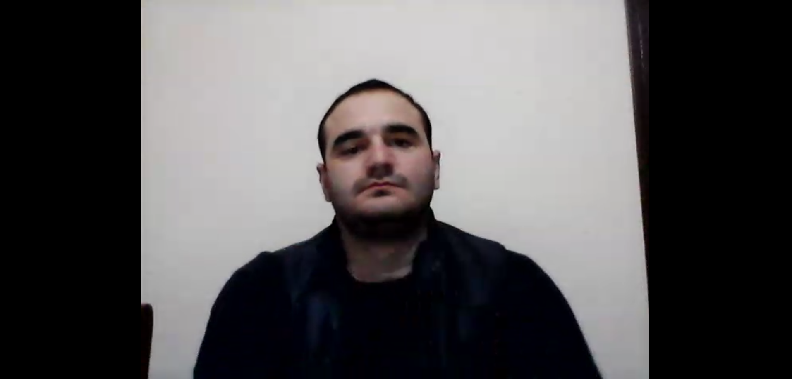
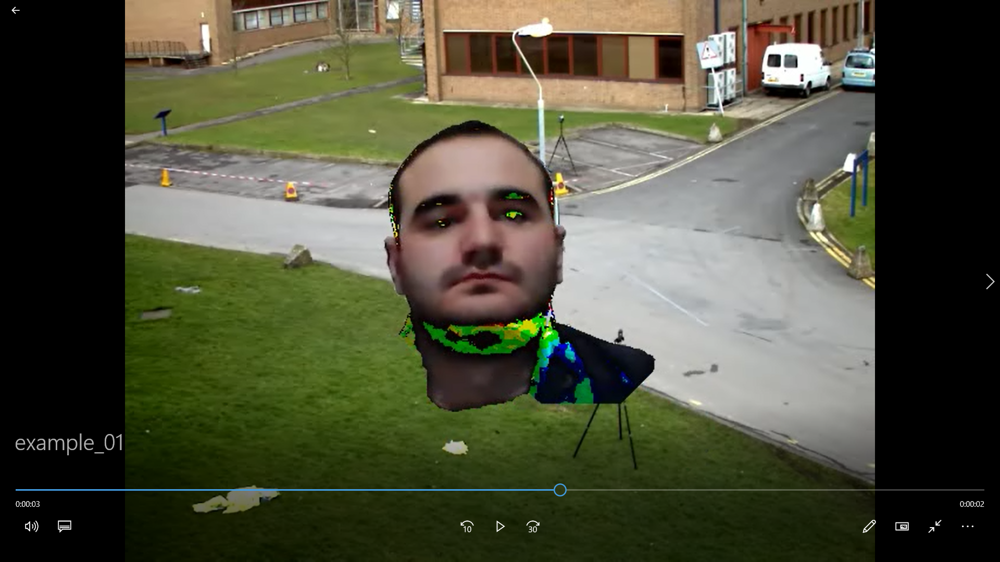
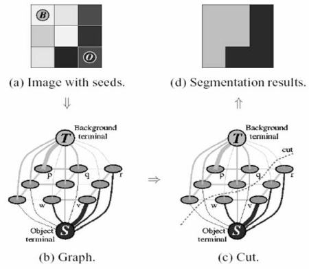

# A small video background editor that allows to substitute background of one video to another

The program allows to specify video files (local paths to the data) through the config.INI configuration file.

Please notice that the videos should have non-moving backgrounds, meaning that the camera used to shoot the videos is fixed on the wall or somewhere else.

The program consists of the following steps:

    1. Background extraction.
    2. Foreground (moving object) extraction and change of background.

## 1. Background subtraction from video.

We can assume most of the time, every pixel sees the same piece of the background because the camera is not moving. Occasionally, moving object comes in the front and obscure the background. For a video sequence, we can randomly sample a few frames (say 25 frames) per second. So, for every pixel, we now have 25 values of the background. As long as a pixel is not covered by a moving object more than 50% of the time, the median of the pixel over these frames will give a good estimate of the background at that pixel.

Another way to do it, is ***Mixture of Gaussians(MOG or new MOG2)***. It is a Gaussian Mixture-based Background/Foreground Segmentation Algorithm, based on two papers by Z.Zivkovic, "Improved adaptive Gausian mixture model for background subtraction" in 2004 and "Efficient Adaptive Density Estimation per Image Pixel for the Task of Background Subtraction" in 2006. One important feature of MOG2 algorithm is that it selects the appropriate number of gaussian distribution for each pixel (for example in MOG, we took a K gaussian distributions throughout the algorithm). It provides better adaptibility to varying scenes due illumination changes etc.

## 2. Foreground extraction and change of background.

We can use ***GrabCut*** algorithm to extract foreground and take linear combination between new background and foreground.

Now a little more details about GrabCut. 

GrabCut algorithm was designed by Carsten Rother, Vladimir Kolmogorov & Andrew Blake from Microsoft Research Cambridge, UK. in their paper, "GrabCut: interactive foreground extraction using iterated graph cuts" . An algorithm was needed for foreground extraction with minimal user interaction, and the result was GrabCut. Initially user draws a rectangle (RoI) around the foreground region (foreground region should be completely inside the rectangle). Then algorithm segments it iteratively to get the best result. Done. But in some cases, the segmentation won't be fine, like, it may have marked some foreground region as background and vice versa. 

Before                     |  After
:-------------------------:|:-------------------------:
    |  

So what happens in background ?

* User inputs the rectangle. Everything outside this rectangle will be taken as sure background (That is the reason it is mentioned before that your rectangle should include all the objects). Everything inside rectangle is unknown. Similarly any user input specifying foreground and background are considered as hard-labelling which means they won't change in the process.

* Computer does an initial labelling depending on the data we gave. It labels the foreground and background pixels (or it hard-labels)

* Now a Gaussian Mixture Model(GMM) is used to model the foreground and background.

* Depending on the data we gave, GMM learns and create new pixel distribution. That is, the unknown pixels are labelled either probable foreground or probable background depending on its relation with the other hard-labelled pixels in terms of color statistics (It is just like clustering).

* A graph is built from this pixel distribution. Nodes in the graphs are pixels. Additional two nodes are added, Source node and Sink node. Every foreground pixel is connected to Source node and every background pixel is connected to Sink node.

* The weights of edges connecting pixels to source node/end node are defined by the probability of a pixel being foreground/background. The weights between the pixels are defined by the edge information or pixel similarity. If there is a large difference in pixel color, the edge between them will get a low weight.

* Then a mincut algorithm is used to segment the graph. It cuts the graph into two separating source node and sink node with minimum cost function. The cost function is the sum of all weights of the edges that are cut. After the cut, all the pixels connected to Source node become foreground and those connected to Sink node become background.

* The process is continued until the classification converges.

It is illustrated in below image:

GrabCut Scheme
:-------------------------:

## Speed/Resource consumption.

There are two resource consumption points:

* Get figure with GrabCut - Each frame takes around 0.7 seconds to get figure, when the number of iterations set 1.

* Inappropriate size of rectangle - It also affects speed apparently. A large rectangle leads slowdown of the algorithm. 

## Usage

1. Make sure you have installed [python3](https://www.python.org/downloads/) and all [required](https://github.com/lev1khachatryan/VideoBackgroundEditor/blob/master/requirements.txt) packages.If you won't be using docker, then run `pip install -r requirements.txt`.

2. Go to python directory.

3. Specify correct paths in [config](https://github.com/lev1khachatryan/VideoBackgroundEditor/blob/master/python/config.INI) file.

4. Run `python bg_fg_combiner.py` in command line.

## Additional works

* [Background extraction with C++](https://github.com/lev1khachatryan/VideoBackgroundEditor/tree/master/cpp/BackgroundSubtractor)

* [Moving Objects extraction](https://github.com/lev1khachatryan/VideoBackgroundEditor/blob/master/python/mo_subtractor.py)

## My Running Environment

### Hardware

* CPU: Intel® Core™ i5-8250U (1.60GHz x 8 cores, 16 threads)

* GPU: NVIDIA® GeForce GTX 1080/PCle/SSE2

* Memory: 8GB GiB

* OS type: 64-bit

* Disk: 1.2 TB

### Operating System

Windows 10 

# Input Data

You can find all necessary videos in the link below:
https://drive.google.com/open?id=18qM8nzz7eRB0t-Bke92Vc0hGTWPu19ym
